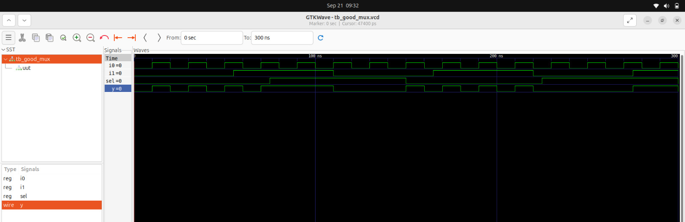
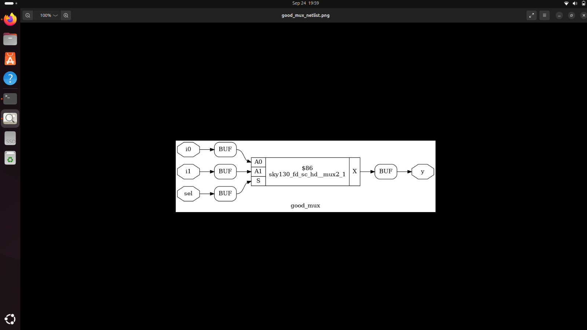

# Day 1: Introduction to Verilog RTL Design & Synthesis

Welcome to **Day 1** of the RTL Workshop! Today marks the beginning of your journey into digital design. You'll learn the fundamentals of Verilog, master open-source simulation with **Icarus Verilog (iverilog)**, and explore the basics of logic synthesis using **Yosys**. This comprehensive guide will walk you through essential concepts with practical, hands-on laboratories.

---

## 🎯 Learning Objectives

By the end of Day 1, you will:
- Understand the role of simulators, designs, and testbenches in digital verification
- Set up and use iverilog for Verilog simulation
- Analyze and interpret waveforms using GTKWave
- Write and understand basic Verilog code structures
- Perform your first logic synthesis using Yosys
- Understand the relationship between RTL and gate-level implementations

---

## Table of Contents

1. [What is a Simulator, Design, and Testbench?](#1-what-is-a-simulator-design-and-testbench)
2. [Getting Started with Icarus Verilog](#2-getting-started-with-icarus-verilog)
3. [Lab: Simulating a 2-to-1 Multiplexer](#3-lab-simulating-a-2-to-1-multiplexer)
4. [Verilog Code Analysis](#4-verilog-code-analysis)
5. [Introduction to Yosys & Gate Libraries](#5-introduction-to-yosys--gate-libraries)
6. [Synthesis Lab with Yosys](#6-synthesis-lab-with-yosys)
7. [Lab Results and Analysis](#7-lab-results-and-analysis)
8. [Summary](#8-summary)

---

## 1. What is a Simulator, Design, and Testbench?

### 🔧 Simulator

A **simulator** is a crucial software tool that verifies your digital circuit's functionality by:
- Applying various test input patterns
- Computing expected outputs based on your design logic
- Providing detailed timing and behavioral analysis
- Enabling debugging before physical implementation

**Key Benefits:**
- ✅ Early bug detection and correction
- ✅ Cost-effective verification (no hardware needed)
- ✅ Comprehensive coverage testing
- ✅ Performance analysis and optimization

### 📋 Design

The **design** represents your actual Verilog RTL code that describes:
- The intended digital logic functionality
- Input/output port definitions
- Internal signal relationships
- Behavioral or structural implementation

### 🧪 Testbench

A **testbench** is a specialized Verilog module that:
- Instantiates your design under test (DUT)
- Generates comprehensive stimulus patterns
- Applies inputs and monitors outputs
- Provides self-checking mechanisms
- Reports pass/fail results

**Testbench Structure:**
```verilog
module testbench;
    // Signal declarations
    reg inputs;
    wire outputs;
    
    // DUT instantiation
    design_module DUT (.in(inputs), .out(outputs));
    
    // Stimulus generation
    initial begin
        // Test cases
    end
    
    // Response monitoring
    // Self-checking logic
endmodule
```

---

## 2. Getting Started with Icarus Verilog

**Icarus Verilog (iverilog)** is a powerful, open-source Verilog simulator that provides:
- IEEE 1364 Verilog standard compliance
- Fast compilation and simulation
- Comprehensive debugging capabilities
- Integration with GTKWave for waveform analysis

### Simulation Flow

The typical iverilog simulation workflow involves:

```
Verilog Design Files    Testbench
        ↓                   ↓
        ├─── iverilog ──────┤
                ↓
        Executable (a.out)
                ↓
        ./a.out (execution)
                ↓
        VCD File Generation
                ↓
        GTKWave (waveform viewing)
```

### Key Features:
- **Fast Simulation**: Optimized for quick turnaround times
- **Standard Compliance**: Full Verilog-2001 and partial Verilog-2005 support
- **Debug Support**: Comprehensive error reporting and warnings
- **Open Source**: Free and actively maintained

---

## 3. Lab: Simulating a 2-to-1 Multiplexer

Let's implement and simulate a fundamental digital building block - the **2-to-1 multiplexer**!

### 📁 Step 1: Set Up Your Workspace

```bash
# Create workspace directory
mkdir -p ~/rtl_workshop/day1
cd ~/rtl_workshop/day1

# Clone workshop files (if not already done)
git clone https://github.com/kunalg123/sky130RTLDesignAndSynthesisWorkshop.git
cd sky130RTLDesignAndSynthesisWorkshop/verilog_files
```

### 🔧 Step 2: Install Required Tools

```bash
# Ubuntu/Debian installation
sudo apt update
sudo apt install iverilog gtkwave

# CentOS/RHEL installation  
sudo yum install iverilog gtkwave

# Verify installation
iverilog -V
gtkwave --version
```

### 🚀 Step 3: Run the Simulation

```bash
# Compile design and testbench
iverilog good_mux.v tb_good_mux.v

# Execute simulation
./a.out

# View waveform
gtkwave tb_good_mux.vcd
```

### 📊 Simulation Results

The simulation generates comprehensive waveforms showing:
- Input signal transitions (i0, i1, sel)
- Output response (y)
- Timing relationships
- Functional verification



**Waveform Analysis:**
- When `sel = 0`: Output `y` follows input `i0`
- When `sel = 1`: Output `y` follows input `i1`
- Clean transitions with no glitches
- Proper functional behavior verified

---

## 4. Verilog Code Analysis

### 📝 Multiplexer Implementation

```verilog
module good_mux (input i0, input i1, input sel, output reg y);
    always @ (*) begin
        if(sel)
            y <= i1;
        else 
            y <= i0;
    end
endmodule
```

### 🔍 Code Breakdown

**Module Declaration:**
- `input i0, i1`: Data inputs to the multiplexer
- `input sel`: Selection control signal
- `output reg y`: Registered output (required for procedural assignments)

**Always Block Analysis:**
- `always @ (*)`: Combinational logic block (sensitive to all inputs)
- `if(sel)`: When sel = 1 (true), select i1
- `else`: When sel = 0 (false), select i0
- `<=`: Non-blocking assignment (good practice for sequential logic)

**Design Characteristics:**
- ✅ **Synthesizable**: Uses standard Verilog constructs
- ✅ **Complete Sensitivity**: `*` includes all referenced signals
- ✅ **No Latches**: All paths assign to output
- ✅ **Clear Logic**: Easy to understand and maintain

### 🧪 Testbench Structure

```verilog
module tb_good_mux;
    reg i0, i1, sel;
    wire y;
    
    // Instantiate DUT
    good_mux uut (.i0(i0), .i1(i1), .sel(sel), .y(y));
    
    initial begin
        $dumpfile("tb_good_mux.vcd");
        $dumpvars(0, tb_good_mux);
        
        // Test cases
        {sel, i0, i1} = 3'b000; #10;
        {sel, i0, i1} = 3'b001; #10;
        {sel, i0, i1} = 3'b010; #10;
        {sel, i0, i1} = 3'b011; #10;
        {sel, i0, i1} = 3'b100; #10;
        {sel, i0, i1} = 3'b101; #10;
        {sel, i0, i1} = 3'b110; #10;
        {sel, i0, i1} = 3'b111; #10;
        
        $finish;
    end
endmodule
```

---

## 5. Introduction to Yosys & Gate Libraries

### 🔬 What is Yosys?

**Yosys** (Yosys Open SYnthesis Suite) is a comprehensive, open-source synthesis framework that:
- Converts RTL descriptions to gate-level netlists
- Performs logic optimization and technology mapping
- Supports various target libraries and formats
- Provides extensive analysis and debugging capabilities

### 🏗️ Yosys Synthesis Flow

```
RTL Verilog Code
       ↓
   [Frontend]
       ↓
   Internal RTL
       ↓
   [Optimization]
       ↓
   Generic Logic
       ↓
   [Technology Mapping]
       ↓
   Gate-Level Netlist
```

### 📚 Understanding Gate Libraries

Gate libraries (`.lib` files) contain essential information about:

**🔧 Gate Characteristics:**
- **Timing Models**: Setup, hold, propagation delays
- **Power Models**: Static and dynamic power consumption
- **Area Information**: Silicon footprint data
- **Drive Strength**: Current sourcing/sinking capabilities

**🎯 Multiple Gate Flavors:**
Different variants of the same logical function optimized for:
- **Performance**: High-speed gates for critical paths
- **Power**: Low-leakage gates for power-sensitive blocks
- **Area**: Compact gates for area-constrained designs
- **Drive Strength**: Various current capabilities for different loads

**📊 Library Selection Factors:**
- **PVT Corners**: Process, Voltage, Temperature variations
- **Threshold Voltages**: High-Vt, Regular-Vt, Low-Vt options
- **Channel Lengths**: Different transistor geometries
- **Supply Voltages**: Multiple voltage domain support

### 🎨 Sky130 PDK Overview

The **Sky130** Process Design Kit provides:
- **130nm CMOS technology**: Mature, stable process
- **Open Source**: Freely available for research and education
- **Standard Cells**: Comprehensive logic library
- **I/O Cells**: Various interface options
- **Memory Compilers**: SRAM generation tools

---

## 6. Synthesis Lab with Yosys

Let's synthesize our multiplexer design and explore the gate-level implementation!

### 🚀 Step-by-Step Synthesis Flow

#### 1. Launch Yosys
```bash
yosys
```

#### 2. Load Standard Cell Library
```tcl
read_liberty -lib /path/to/sky130_fd_sc_hd__tt_025C_1v80.lib
```

#### 3. Read RTL Design
```tcl
read_verilog good_mux.v
```

#### 4. Elaborate and Synthesize
```tcl
synth -top good_mux
```

**Synthesis Output Analysis:**
- **Module Statistics**: Cell counts and types
- **Wire Statistics**: Net counts and fanouts
- **Resource Utilization**: Logic element usage

#### 5. Technology Mapping
```tcl
abc -liberty /path/to/sky130_fd_sc_hd__tt_025C_1v80.lib
```

**ABC Optimization:**
- **Logic Minimization**: Boolean optimization
- **Technology Mapping**: Gate selection and mapping
- **Area/Delay Trade-offs**: Optimization targets

#### 6. Generate Gate-Level Netlist
```tcl
write_verilog -noattr good_mux_netlist.v
```

#### 7. Visualize Implementation
```tcl
show
```

### 📋 Synthesis Statistics

The synthesis process provides detailed statistics:
- **Cell Usage**: Types and quantities of standard cells
- **Wire Count**: Total interconnect requirements
- **Critical Path**: Longest delay path through design
- **Area Estimate**: Rough silicon area consumption

---

## 7. Lab Results and Analysis

### 🖼️ Synthesis Visualization

The Yosys `show` command generates a graphical representation of the synthesized netlist:



**Netlist Analysis:**
- **Gate Selection**: Optimal standard cells chosen
- **Logic Structure**: Hierarchical organization maintained
- **Interconnections**: Signal routing and fanout
- **Optimization Results**: Logic minimization effects

### 📊 Implementation Details

**Gate-Level Characteristics:**
- **Cell Type**: Standard cell from Sky130 library
- **Logic Function**: Implements 2:1 MUX functionality
- **Timing Properties**: Propagation delay characteristics
- **Power Profile**: Static and dynamic power estimates

### 🔍 RTL vs Gate-Level Comparison

| Aspect | RTL Design | Gate-Level Netlist |
|--------|------------|-------------------|
| **Abstraction** | High-level behavioral | Low-level structural |
| **Readability** | Human-friendly | Tool-optimized |
| **Simulation** | Functional verification | Timing-accurate |
| **Synthesis** | Input to synthesis | Output from synthesis |
| **Optimization** | Designer-controlled | Tool-optimized |

---

## 8. Summary

### 🎯 Key Accomplishments

Today you have successfully:
- ✅ **Mastered Simulation Basics**: Understood the role of simulators, designs, and testbenches
- ✅ **Hands-on Tool Experience**: Used iverilog for simulation and GTKWave for waveform analysis
- ✅ **Analyzed Verilog Code**: Deconstructed a 2:1 multiplexer implementation
- ✅ **Explored Synthesis Concepts**: Learned about Yosys and gate library fundamentals
- ✅ **Completed First Synthesis**: Converted RTL to gate-level netlist
- ✅ **Visualized Results**: Examined synthesis outputs and netlists

### 🔑 Important Concepts Learned

**Simulation Fundamentals:**
- Importance of comprehensive testbenches
- Waveform analysis techniques
- Debugging strategies

**RTL Design Principles:**
- Clean, synthesizable coding practices
- Proper sensitivity list usage
- Avoiding unintended latch inference

**Synthesis Understanding:**
- RTL to gate-level transformation process
- Technology library importance
- Optimization trade-offs

### 🚀 Next Steps

Prepare for **Day 2** where you'll dive deeper into:
- **Timing Libraries**: Detailed .lib file analysis
- **Hierarchical Synthesis**: Design organization strategies
- **Flip-Flop Coding**: Sequential logic best practices
- **Advanced Optimization**: Performance tuning techniques

---

### 💡 Pro Tips for Success

1. **Practice Regularly**: Experiment with different Verilog constructs
2. **Read Synthesis Reports**: Understand what the tools are telling you
3. **Visualize Your Logic**: Use `show` command to see gate-level implementations
4. **Test Thoroughly**: Comprehensive testbenches catch more bugs
5. **Learn from Warnings**: Synthesis warnings often indicate design issues

---

<div align="center">

**🎉 Congratulations on Completing Day 1! 🎉**

*You've taken the first important step in your RTL design journey!*

**Ready for Day 2?** → [Day 2: Timing Libraries & Flip-Flop Coding](../Day_2/README.md)

</div>

---

## 📚 Additional Resources

- [Icarus Verilog Documentation](http://iverilog.icarus.com/)
- [GTKWave User Guide](http://gtkwave.sourceforge.net/)
- [Yosys Manual](http://www.clifford.at/yosys/documentation.html)
- [Sky130 PDK Documentation](https://skywater-pdk.readthedocs.io/)

**Happy Learning! 🚀**