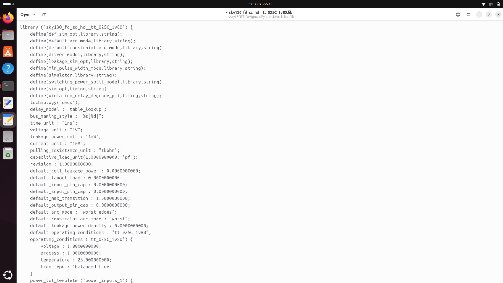
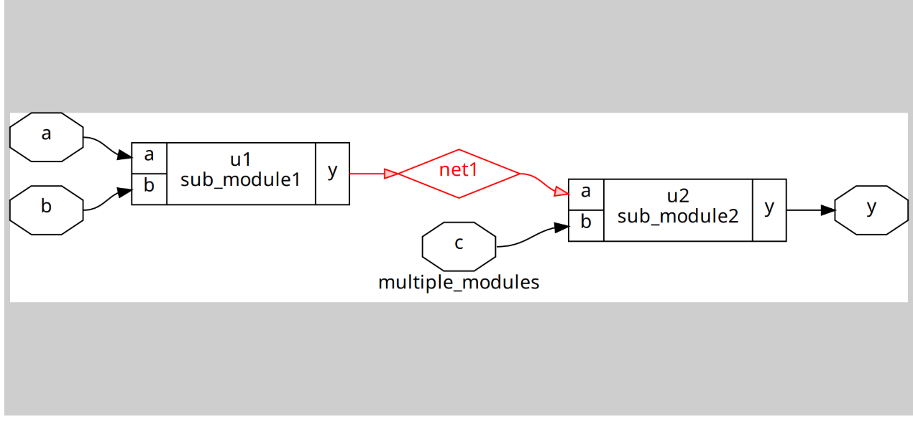
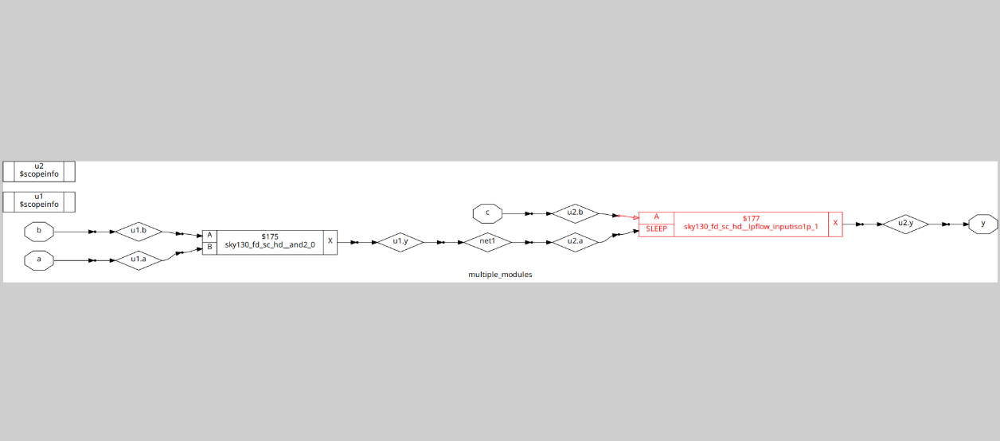
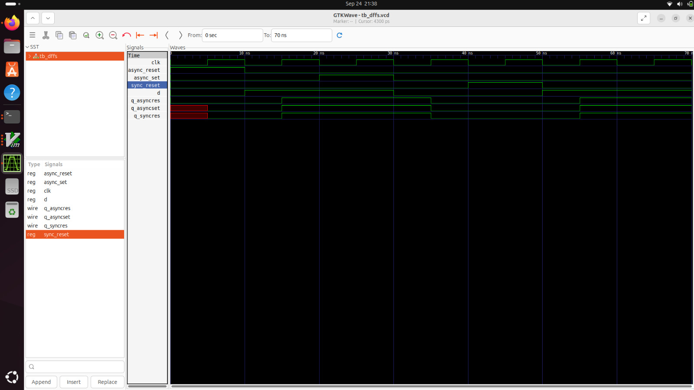
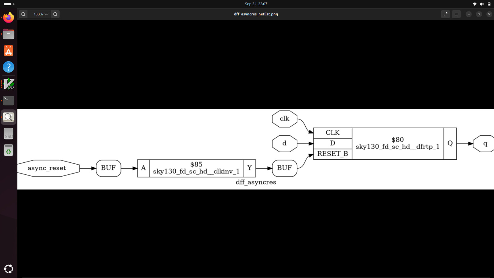

# Day 2: Timing Libraries, Synthesis Approaches, and Efficient Flip-Flop Coding

Welcome to **Day 2** of the RTL Workshop! Today we dive deeper into the essential components of digital design synthesis. You'll explore timing libraries in detail, understand different synthesis approaches, and master various flip-flop coding styles that are fundamental to sequential circuit design.

---

## 🎯 Learning Objectives

By the end of Day 2, you will:
- Understand timing library (.lib) structure and characteristics
- Explore the Sky130 PDK timing models in detail  
- Compare hierarchical vs. flattened synthesis approaches
- Master different flip-flop coding styles and their synthesis implications
- Analyze the impact of coding choices on synthesis results
- Gain proficiency with Yosys synthesis commands and options

---

## Table of Contents

1. [Introduction to Timing Libraries](#1-introduction-to-timing-libraries)
2. [Sky130 PDK Deep Dive](#2-sky130-pdk-deep-dive)
3. [Hierarchical vs. Flattened Synthesis](#3-hierarchical-vs-flattened-synthesis)
4. [Flip-Flop Coding Styles](#4-flip-flop-coding-styles)
5. [Synthesis and Simulation Workflow](#5-synthesis-and-simulation-workflow)
6. [Lab Results and Analysis](#6-lab-results-and-analysis)
7. [Summary](#7-summary)

---

## 1. Introduction to Timing Libraries

### 📚 What is a Timing Library (.lib)?

A **timing library** is a comprehensive database that contains detailed electrical and timing characteristics of all standard cells in a particular technology node. It serves as the foundation for:

- **Static Timing Analysis (STA)**: Path delay calculations
- **Power Analysis**: Dynamic and leakage power estimation  
- **Synthesis Optimization**: Gate selection and optimization
- **Physical Design**: Placement and routing decisions

### 🔍 Library File Structure

A typical `.lib` file contains:

```liberty
library(sky130_fd_sc_hd__tt_025C_1v80) {
    technology : cmos;
    delay_model : table_lookup;
    
    operating_conditions(tt_025C_1v80) {
        process : 1.0;
        temperature : 25.0;
        voltage : 1.80;
        tree_type : balanced_tree;
    }
    
    // Cell definitions
    cell(sky130_fd_sc_hd__and2_1) {
        area : 5.0176;
        cell_leakage_power : 0.0013927;
        
        pin(A) {
            capacitance : 0.0017;
            direction : input;
        }
        // ... more pin definitions
        
        timing() {
            // Timing arcs and tables
        }
    }
}
```

### ⚡ Key Library Parameters

**Process, Voltage, Temperature (PVT) Corners:**
- **Process**: Fast (FF), Typical (TT), Slow (SS)
- **Voltage**: Nominal, High, Low supply voltages
- **Temperature**: Operating temperature ranges

**Timing Models:**
- **Setup Time**: Minimum data stable time before clock edge
- **Hold Time**: Minimum data stable time after clock edge  
- **Propagation Delay**: Input to output delay characteristics
- **Transition Time**: Rise/fall time specifications

---

## 2. Sky130 PDK Deep Dive

### 🌟 Sky130 Technology Overview

The **SkyWater 130nm** process offers:
- **Mature Technology**: Proven, stable manufacturing process
- **Open Source PDK**: Freely available for education and research
- **Comprehensive Library**: Full suite of digital standard cells
- **Mixed-Signal Support**: Analog and RF components available

### 📋 Library Naming Convention Analysis

**`sky130_fd_sc_hd__tt_025C_1v80.lib`** breakdown:

| Component | Meaning | Description |
|-----------|---------|-------------|
| `sky130` | Technology Node | 130nm CMOS process |
| `fd` | Foundry | Foundry Design |
| `sc` | Cell Type | Standard Cells |
| `hd` | Density | High Density variant |
| `tt` | Process Corner | Typical-Typical corner |
| `025C` | Temperature | 25°C operating condition |
| `1v80` | Supply Voltage | 1.8V nominal supply |



**PDK Components Explored:**
- Standard cell libraries with various drive strengths
- Timing and power characterization data
- Physical layout views and design rules
- Process-specific electrical parameters

### 🔧 Standard Cell Variants

The Sky130 library includes multiple variants of each gate:

**Drive Strength Variations:**
- `_1`: 1X drive strength (minimum)
- `_2`: 2X drive strength 
- `_4`: 4X drive strength
- `_8`: 8X drive strength (maximum)

**Threshold Voltage Options:**
- **Regular-Vt**: Balance between speed and leakage
- **High-Vt**: Low leakage, slower switching
- **Low-Vt**: Fast switching, higher leakage

---

## 3. Hierarchical vs. Flattened Synthesis

### 🏗️ Hierarchical Synthesis

**Hierarchical synthesis** preserves the design hierarchy during synthesis:

**Advantages:**
- ✅ **Design Organization**: Maintains logical module boundaries
- ✅ **Incremental Changes**: Modify individual modules without full re-synthesis
- ✅ **Design Reuse**: Modules can be optimized and reused
- ✅ **Debug Friendly**: Easier to trace and debug specific modules
- ✅ **Parallel Processing**: Different modules can be synthesized independently

**Yosys Command:**
```tcl
synth -top module_name -flatten 0
```



**Hierarchical Result Analysis:**
- Individual sub-modules preserved in netlist
- Inter-module connections clearly visible
- Module boundaries maintained for easier analysis
- Potential for module-level optimization

### 📋 Flattened Synthesis

**Flattened synthesis** removes hierarchy and creates a single-level netlist:

**Advantages:**
- ✅ **Global Optimization**: Cross-hierarchy optimizations possible
- ✅ **Better Area/Power**: More aggressive optimization opportunities
- ✅ **Simplified Netlist**: Single-level structure
- ✅ **Timing Optimization**: Better critical path optimization

**Yosys Command:**
```tcl
synth -top module_name -flatten
# or
flatten
```



**Flattened Result Analysis:**
- All logic combined into single module
- Hierarchy boundaries removed
- Potential for more aggressive optimization
- May be harder to debug and maintain

### ⚖️ Synthesis Approach Comparison

| Aspect | Hierarchical | Flattened |
|--------|-------------|-----------|
| **Optimization Scope** | Per-module | Global |
| **Design Debug** | Easier | More difficult |
| **Incremental Changes** | Supported | Full re-synthesis |
| **Area Efficiency** | Good | Better |
| **Timing Closure** | Module-limited | Global |
| **Design Reuse** | Excellent | Limited |

---

## 4. Flip-Flop Coding Styles

Understanding different flip-flop implementations is crucial for effective sequential design. Each style has specific synthesis implications and use cases.

### 🔄 Asynchronous Reset D Flip-Flop

**Implementation:**
```verilog
module dff_asyncres (
    input clk, reset, d,
    output reg q
);
    always @(posedge clk or posedge reset) begin
        if (reset)
            q <= 1'b0;
        else
            q <= d;
    end
endmodule
```

**Key Characteristics:**
- **Reset Priority**: Reset overrides clock
- **Sensitivity List**: Includes both `clk` and `reset`
- **Reset Polarity**: Active high reset
- **Synthesis Result**: Uses library D flip-flop with async reset

**Use Cases:**
- System initialization and reset
- Critical control signals
- Power-on reset sequences

### ⬆️ Asynchronous Set D Flip-Flop

**Implementation:**
```verilog
module dff_async_set (
    input clk, async_set, d,
    output reg q
);
    always @(posedge clk or posedge async_set) begin
        if (async_set)
            q <= 1'b1;
        else
            q <= d;
    end
endmodule
```

**Key Characteristics:**
- **Set Priority**: Set overrides clock
- **Initial State**: Asynchronously sets output to '1'
- **Synthesis**: Maps to library flip-flop with async preset

### 🔄 Synchronous Reset D Flip-Flop

**Implementation:**
```verilog
module dff_syncres (
    input clk, sync_reset, d,
    output reg q
);
    always @(posedge clk) begin
        if (sync_reset)
            q <= 1'b0;
        else
            q <= d;
    end
endmodule
```

**Key Characteristics:**
- **Clock Synchronized**: Reset only effective at clock edge
- **Sensitivity List**: Only includes `clk`
- **Glitch Immunity**: Reset synchronized to clock domain
- **Synthesis**: May use mux before D flip-flop input

**Advantages:**
- Better timing characteristics
- Reduced metastability risk
- Easier timing closure

### ⚖️ Asynchronous vs. Synchronous Reset Comparison

| Aspect | Asynchronous Reset | Synchronous Reset |
|--------|--------------------|-------------------|
| **Reset Timing** | Independent of clock | Clock synchronized |
| **Area** | Smaller | Larger (additional logic) |
| **Power** | Lower | Higher |
| **Timing Closure** | More challenging | Easier |
| **Glitch Sensitivity** | Higher | Lower |
| **Recovery Time** | Critical parameter | Not applicable |

---

## 5. Synthesis and Simulation Workflow

### 🔄 Comprehensive Design Flow

The complete workflow for Day 2 involves multiple steps integrating simulation and synthesis:

#### **Step 1: RTL Simulation**
```bash
# Compile and simulate
iverilog dff_asyncres.v tb_dff_asyncres.v
./a.out
gtkwave tb_dff_asyncres.vcd
```



**Waveform Analysis:**
- Clock signal transitions and timing
- Reset assertion and deassertion effects
- Data input changes and propagation
- Output response to various input conditions
- Setup and hold time relationships

#### **Step 2: Synthesis with Yosys**

**Complete Synthesis Flow:**
```tcl
# Launch Yosys
yosys

# Read liberty library
read_liberty -lib sky130_fd_sc_hd__tt_025C_1v80.lib

# Read Verilog design
read_verilog dff_asyncres.v

# Synthesize the design
synth -top dff_asyncres

# Map flip-flops to library cells
dfflibmap -liberty sky130_fd_sc_hd__tt_025C_1v80.lib

# Technology mapping for combinational logic
abc -liberty sky130_fd_sc_hd__tt_025C_1v80.lib

# Generate netlist
write_verilog -noattr dff_asyncres_netlist.v

# Visualize the result
show
```

#### **Step 3: Gate-Level Simulation (Optional)**
```bash
# Simulate synthesized netlist
iverilog -I/path/to/primitives/ dff_asyncres_netlist.v tb_dff_asyncres.v
./a.out
gtkwave tb_dff_asyncres.vcd
```

---

## 6. Lab Results and Analysis

### 📊 Synthesis Results

The synthesis process generates detailed information about the implementation:



**Netlist Analysis:**
- **Standard Cell Selection**: Specific Sky130 flip-flop chosen
- **Port Connections**: Clock, reset, data, and output mapping
- **Additional Logic**: Any combinational logic for control signals
- **Resource Utilization**: Area and power estimates

### 🔍 Comparative Analysis

**Different Flip-Flop Styles Synthesis Results:**

| DFF Type | Standard Cell Used | Area | Power | Complexity |
|----------|-------------------|------|-------|------------|
| Async Reset | `sky130_fd_sc_hd__dfxbp_1` | Small | Low | Simple |
| Async Set | `sky130_fd_sc_hd__dfsbp_1` | Small | Low | Simple |
| Sync Reset | `sky130_fd_sc_hd__dfxtp_1` + MUX | Medium | Medium | Complex |

### 📈 Performance Characteristics

**Timing Analysis:**
- **Clock-to-Q Delay**: Propagation delay from clock to output
- **Setup Time**: Required data stability before clock
- **Hold Time**: Required data stability after clock
- **Reset Recovery**: Time from reset deassertion to valid operation

**Power Analysis:**
- **Dynamic Power**: Switching activity related
- **Static Power**: Leakage current contribution
- **Clock Power**: Clock network power consumption

---

## 7. Summary

### 🎯 Key Accomplishments

Today you have successfully:

- ✅ **Mastered Timing Libraries**: Understood .lib file structure and Sky130 PDK characteristics
- ✅ **Explored Synthesis Approaches**: Compared hierarchical vs. flattened synthesis methods
- ✅ **Learned Flip-Flop Coding**: Implemented various sequential logic styles
- ✅ **Analyzed Synthesis Results**: Interpreted gate-level implementations and optimizations
- ✅ **Practiced Tool Workflows**: Used advanced Yosys commands for different synthesis scenarios

### 🔑 Critical Concepts Learned

**Timing Library Fundamentals:**
- PVT corner significance and impact
- Standard cell characteristics and selection criteria
- Library naming conventions and organization

**Synthesis Strategy Impact:**
- When to use hierarchical vs. flattened approaches
- Trade-offs between optimization levels and design maintainability
- Impact on final implementation quality

**Sequential Logic Design:**
- Asynchronous vs. synchronous control signal handling
- Reset and set implementation considerations
- Timing closure implications of different coding styles

### 🚀 Looking Ahead to Day 3

Prepare for **Day 3** where you'll explore:
- **Combinational Logic Optimization**: Advanced optimization techniques
- **Sequential Logic Optimization**: State machine and flip-flop optimizations
- **Constant Propagation**: Logic simplification methods
- **Advanced Synthesis Commands**: Fine-tuning synthesis results

---

### 💡 Design Best Practices

1. **Choose Reset Style Carefully**: Consider timing, area, and power requirements
2. **Understand Library Options**: Select appropriate drive strengths and threshold voltages
3. **Consider Synthesis Approach**: Match synthesis strategy to design goals
4. **Verify Across Corners**: Test designs under different PVT conditions
5. **Review Synthesis Reports**: Always analyze synthesis statistics and warnings

---

<div align="center">

**🎉 Excellent Progress on Day 2! 🎉**

*You've built a solid foundation in timing libraries and sequential logic design!*

**Ready for Day 3?** → [Day 3: Combinational and Sequential Optimization](../Day_3/README.md)

</div>

---

## 📚 Additional Resources

- [Liberty Format Reference](https://people.eecs.berkeley.edu/~alanmi/publications/other/liberty07_03.pdf)
- [Sky130 PDK Documentation](https://skywater-pdk.readthedocs.io/)
- [Yosys Synthesis Guide](http://www.clifford.at/yosys/documentation.html)
- [Static Timing Analysis Fundamentals](https://www.vlsi-expert.com/2011/03/static-timing-analysis-sta-basic.html)

**Keep up the excellent work! 🚀**