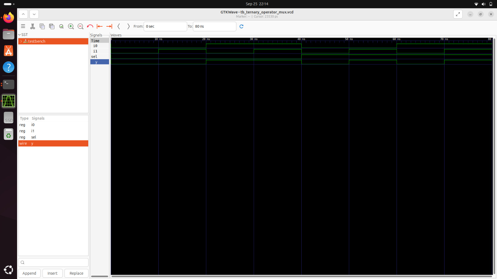
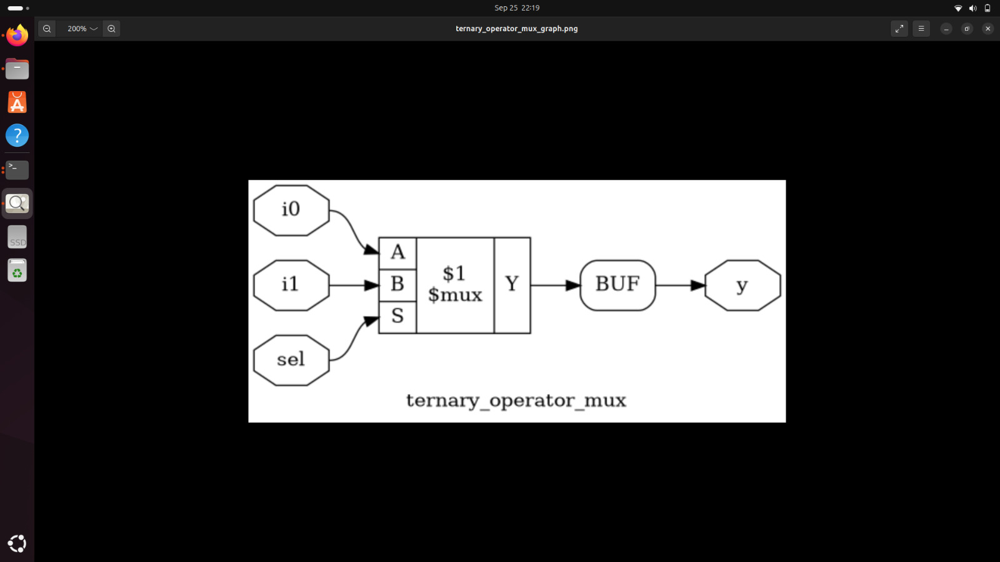
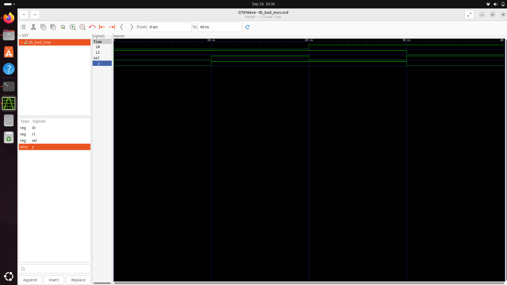
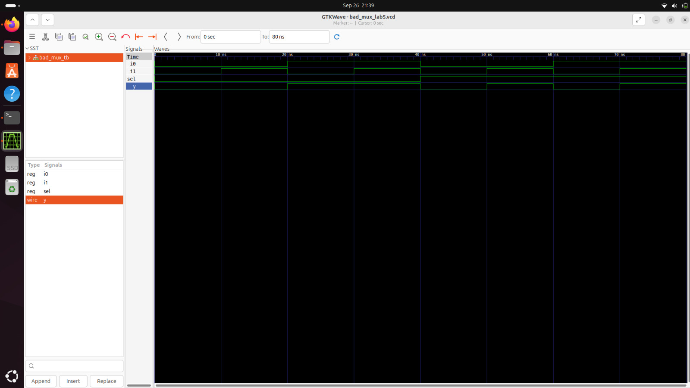
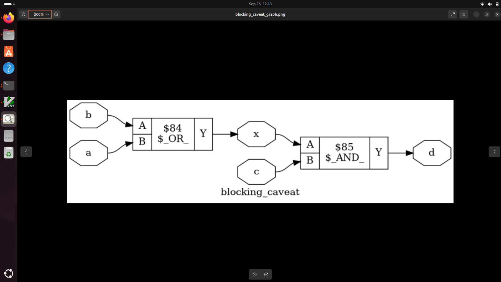

# Day 4: Gate-Level Simulation, Blocking vs. Non-Blocking, and Synthesis-Simulation Mismatch

Welcome to **Day 4** of the RTL Workshop! Today we tackle some of the most critical aspects of digital verification and synthesis: Gate-Level Simulation (GLS), the nuanced differences between blocking and non-blocking assignments, and how to identify and resolve synthesis-simulation mismatches.

---

## 🎯 Learning Objectives

By the end of Day 4, you will:
- Master Gate-Level Simulation (GLS) concepts and implementation
- Understand the critical differences between blocking and non-blocking assignments
- Identify and debug synthesis-simulation mismatches effectively
- Apply proper Verilog coding practices to avoid common pitfalls
- Perform comprehensive verification using both RTL and gate-level simulations
- Analyze timing behavior and signal integrity in synthesized designs

---

## Table of Contents

1. [Gate-Level Simulation (GLS) Fundamentals](#1-gate-level-simulation-gls-fundamentals)
2. [Synthesis-Simulation Mismatch Analysis](#2-synthesis-simulation-mismatch-analysis)
3. [Blocking vs. Non-Blocking Assignments](#3-blocking-vs-non-blocking-assignments)
4. [Practical Laboratory Exercises](#4-practical-laboratory-exercises)
5. [Advanced Debugging Techniques](#5-advanced-debugging-techniques)
6. [Best Practices and Guidelines](#6-best-practices-and-guidelines)
7. [Summary](#7-summary)

---

## 1. Gate-Level Simulation (GLS) Fundamentals

### 🔍 What is Gate-Level Simulation?

**Gate-Level Simulation (GLS)** is a critical verification step that simulates the synthesized gate-level netlist instead of the original RTL code. This process validates:

- **Functional Correctness**: Ensures synthesis preserved design behavior
- **Timing Accuracy**: Validates real-world timing characteristics
- **Power Analysis**: Provides accurate power consumption estimates
- **Test Coverage**: Verifies fault detection and test patterns

### 🎯 GLS vs. RTL Simulation Comparison

| Aspect | RTL Simulation | Gate-Level Simulation |
|--------|---------------|----------------------|
| **Abstraction Level** | High-level behavioral | Low-level structural |
| **Simulation Speed** | Fast | Slower (more detailed) |
| **Timing Accuracy** | Functional only | Timing-accurate |
| **Power Analysis** | Estimates | Accurate measurements |
| **Debug Ease** | Easy (readable code) | Challenging (gate-level) |
| **Coverage** | Functional | Functional + Structural |

### ⚡ Types of Gate-Level Simulation

**1. Functional GLS:**
- Zero-delay or unit-delay simulation
- Focuses on logical correctness
- Fast execution for functional verification

**2. Timing-Accurate GLS:**
- Uses SDF (Standard Delay Format) annotations
- Models real propagation delays
- Critical for timing closure verification

**3. Power-Aware GLS:**
- Includes power library models
- Estimates dynamic and static power
- Essential for power optimization

### 🔄 GLS Workflow

```
RTL Design
    ↓
Synthesis (Yosys)
    ↓
Gate-Level Netlist
    ↓
SDF Generation (Optional)
    ↓
GLS Simulation
    ↓
Verification Results
```

---

## 2. Synthesis-Simulation Mismatch Analysis

### 🚨 What Causes Synthesis-Simulation Mismatch?

**Synthesis-simulation mismatch** occurs when RTL simulation results differ from gate-level simulation or actual hardware behavior. Common causes include:

**1. Non-Synthesizable Constructs:**
- Initial blocks (except for synthesis directives)
- Delay statements (`#delay`)
- Forever loops without proper termination
- System tasks in synthesizable code

**2. Incomplete Sensitivity Lists:**
```verilog
// Problematic - incomplete sensitivity list
always @(sel) begin  // Missing i0, i1 in sensitivity list
    if (sel)
        y <= i1;
    else
        y <= i0;
end

// Correct - complete sensitivity list  
always @(*) begin   // or @(sel, i0, i1)
    if (sel)
        y <= i1;
    else
        y <= i0;
end
```

**3. Improper Assignment Types:**
```verilog
// Problematic - non-blocking in combinational logic
always @(*) begin
    y <= a & b;  // Should use blocking assignment
end

// Correct - blocking assignment for combinational logic
always @(*) begin
    y = a & b;
end
```

### 🔍 Detecting Synthesis-Simulation Mismatch

**Detection Methods:**
1. **Direct Comparison**: Compare RTL and GLS simulation results
2. **Formal Verification**: Use formal tools to prove equivalence
3. **Regression Testing**: Run comprehensive test suites on both versions

**Warning Signs:**
- Different simulation results between RTL and GLS
- Synthesis warnings about inferred latches
- Timing violations in static timing analysis
- Unexpected behavior during silicon testing

---

## 3. Blocking vs. Non-Blocking Assignments

### 📋 Assignment Types Overview

Verilog provides two procedural assignment types with fundamentally different execution models:

### ⚡ Blocking Assignments (`=`)

**Characteristics:**
- **Execution**: Sequential, immediate
- **Scheduling**: Executes in order, blocks subsequent statements
- **Best Use**: Combinational logic modeling
- **Timing**: Updates immediately during simulation time

**Example:**
```verilog
always @(*) begin
    temp = a & b;      // Executes first
    y = temp | c;      // Uses updated value of temp
end
```

**Execution Flow:**
1. `temp` gets value of `a & b`
2. Statement completes before next statement
3. `y` uses the updated value of `temp`

### ⏰ Non-Blocking Assignments (`<=`)

**Characteristics:**
- **Execution**: Concurrent, scheduled
- **Scheduling**: All assignments evaluate simultaneously
- **Best Use**: Sequential logic modeling (flip-flops, latches)
- **Timing**: Updates at end of current simulation time step

**Example:**
```verilog
always @(posedge clk) begin
    q1 <= d;           // Both assignments evaluate
    q2 <= q1;          // using current values of RHS
end
```

**Execution Flow:**
1. Both RHS expressions evaluate simultaneously
2. Assignments scheduled for end of time step
3. All LHS variables update simultaneously

### ⚖️ Detailed Comparison Table

| Feature | Blocking (`=`) | Non-Blocking (`<=`) |
|---------|----------------|-------------------|
| **Execution Order** | Sequential | Concurrent |
| **Update Time** | Immediate | End of time step |
| **Combinational Logic** | ✅ Recommended | ❌ Avoid |
| **Sequential Logic** | ❌ Avoid | ✅ Recommended |
| **Simulation Performance** | Faster | Slightly slower |
| **Hardware Modeling** | Doesn't model real HW | Models real HW behavior |

### 🚨 Common Mistakes and Solutions

**Mistake 1: Non-blocking in Combinational Logic**
```verilog
// Problematic
always @(*) begin
    y <= a & b;  // May cause race conditions
end

// Solution
always @(*) begin
    y = a & b;   // Proper blocking assignment
end
```

**Mistake 2: Blocking in Sequential Logic**
```verilog
// Problematic - doesn't model real flip-flop behavior
always @(posedge clk) begin
    q1 = d;      // Immediate update
    q2 = q1;     // Uses updated q1 value
end

// Solution - models real flip-flop chain
always @(posedge clk) begin
    q1 <= d;     // Scheduled update
    q2 <= q1;    // Uses old q1 value
end
```

---

## 4. Practical Laboratory Exercises

### 🔬 Lab 1: Ternary Operator MUX

**Design Implementation:**
```verilog
module ternary_operator_mux (
    input i0, i1, sel,
    output y
);
    assign y = sel ? i1 : i0;
endmodule
```

**Analysis:**
- Clean combinational logic using continuous assignment
- No procedural blocks needed for simple multiplexer
- Synthesis produces optimal gate-level implementation



**Key Observations:**
- Direct mapping to 2:1 MUX standard cell
- Clean timing characteristics
- No synthesis-simulation mismatch potential

### 🔬 Lab 2: Yosys Synthesis Flow

**Synthesis Commands:**
```tcl
yosys
read_liberty -lib sky130_fd_sc_hd__tt_025C_1v80.lib
read_verilog ternary_operator_mux.v
synth -top ternary_operator_mux
abc -liberty sky130_fd_sc_hd__tt_025C_1v80.lib
write_verilog -noattr ternary_mux_netlist.v
show
```



**Synthesis Analysis:**
- Tool selects optimal standard cell
- Area and timing optimized implementation
- Clean netlist generation for GLS

### 🔬 Lab 3: Gate-Level Simulation

**GLS Setup:**
```bash
# Compile with technology library
iverilog -I/path/to/sky130_libs/ \
         ternary_mux_netlist.v \
         tb_ternary_operator_mux.v \
         sky130_fd_sc_hd.v

# Run simulation
./a.out

# Compare with RTL simulation
gtkwave ternary_mux_gls.vcd
```


**GLS Verification:**
- Functional equivalence confirmed
- Timing behavior analyzed
- No synthesis-simulation mismatch detected

### 🔬 Lab 4: Bad MUX Design (Common Pitfalls)

**Problematic Implementation:**
```verilog
module bad_mux (
    input i0, i1, sel,
    output reg y
);
    always @(sel) begin      // Incomplete sensitivity list!
        if (sel)
            y <= i1;         // Non-blocking in combinational logic!
        else
            y <= i0;
    end
endmodule
```

**Issues Identified:**
1. **Incomplete Sensitivity List**: Missing `i0` and `i1`
2. **Wrong Assignment Type**: Non-blocking for combinational logic
3. **Synthesis Mismatch**: Simulation vs. hardware behavior differs



**Corrected Version:**
```verilog
module good_mux (
    input i0, i1, sel,
    output reg y
);
    always @(*) begin        // Complete sensitivity list
        if (sel)
            y = i1;          // Blocking assignment
        else
            y = i0;
    end
endmodule
```

### 🔬 Lab 5: GLS of Bad MUX

**Simulation Comparison:**
- RTL simulation shows incorrect behavior
- GLS reveals synthesis-imposed corrections
- Demonstrates importance of proper coding practices



**Mismatch Analysis:**
- RTL simulation doesn't respond to `i0`/`i1` changes when `sel` constant
- GLS shows correct behavior due to synthesis optimization
- Highlights need for proper sensitivity lists

### 🔬 Lab 6: Blocking Assignment Caveat

**Design Example:**
```verilog
module blocking_caveat (
    input a, b, c,
    output reg d
);
    reg x;
    always @(*) begin
        d = x & c;    // Uses old value of x!
        x = a | b;    // Updates x after d calculation
    end
endmodule
```

**Problem Analysis:**
- Order dependency in blocking assignments
- `d` calculated using previous value of `x`
- Synthesis may optimize differently than simulation


**Corrected Version:**
```verilog
module blocking_caveat_fixed (
    input a, b, c,
    output reg d
);
    reg x;
    always @(*) begin
        x = a | b;    // Calculate x first
        d = x & c;    // Use updated value of x
    end
endmodule
```

### 🔬 Lab 7: Synthesis Comparison

**Synthesis Analysis:**
- Compare original vs. corrected versions
- Understand optimization differences
- Verify functional equivalence



**Key Learning:**
- Statement order matters in blocking assignments
- Synthesis tools may optimize based on dependencies
- Always verify with comprehensive testbenches

---

## 5. Advanced Debugging Techniques

### 🔍 Systematic Debug Approach

**1. Identify Mismatch:**
```bash
# Compare RTL and GLS outputs
diff rtl_simulation.log gls_simulation.log

# Use waveform comparison tools
gtkwave rtl_sim.vcd gls_sim.vcd
```

**2. Analyze Synthesis Warnings:**
```tcl
# Check for synthesis warnings
yosys> synth -top module_name -check
yosys> check
```

**3. Review Code Systematically:**
- Check all sensitivity lists for completeness
- Verify assignment types (blocking vs. non-blocking)
- Look for non-synthesizable constructs
- Ensure all code paths assign to outputs

### 🛠️ Debug Tools and Techniques

**Static Analysis:**
- Lint checkers for coding style violations
- Formal verification tools for equivalence checking
- Static timing analysis for timing violations

**Dynamic Analysis:**
- Assertion-based verification
- Coverage analysis to find untested scenarios
- Power analysis for unexpected power consumption

**Visualization Tools:**
- Schematic viewers for gate-level understanding
- Waveform comparison tools
- Timing analysis GUIs

---

## 6. Best Practices and Guidelines

### ✅ Coding Best Practices

**1. Use Proper Assignment Types:**
```verilog
// Combinational logic - use blocking
always @(*) begin
    y = a & b;
end

// Sequential logic - use non-blocking
always @(posedge clk) begin
    q <= d;
end
```

**2. Complete Sensitivity Lists:**
```verilog
// Always use @(*) for combinational logic
always @(*) begin  // Not @(some_signals)
    // combinational logic
end
```

**3. Avoid Mixed Assignments:**
```verilog
// Don't mix blocking and non-blocking in same block
always @(posedge clk) begin
    q1 <= d1;     // All non-blocking
    q2 <= d2;     // Consistent style
end
```

### 🎯 Verification Strategy

**1. Comprehensive Testbenches:**
- Test all functional scenarios
- Include corner cases and edge conditions
- Use both directed and random testing

**2. Multi-Level Verification:**
- RTL simulation for functional verification
- GLS for timing and synthesis verification
- Hardware validation for final confirmation

**3. Continuous Verification:**
- Regression testing after code changes
- Automated comparison between RTL and GLS
- Regular synthesis quality checks

### 🚫 Common Pitfalls to Avoid

1. **Incomplete Sensitivity Lists**: Always use `@(*)` for combinational logic
2. **Wrong Assignment Types**: Blocking for combinational, non-blocking for sequential
3. **Race Conditions**: Mixing blocking and non-blocking inappropriately
4. **Non-Synthesizable Code**: Avoid delays and non-standard constructs in synthesis
5. **Inadequate Testing**: Always verify both RTL and gate-level implementations

---

## 7. Summary

### 🎯 Key Accomplishments

Today you have successfully:

- ✅ **Mastered GLS Concepts**: Understood the importance and implementation of gate-level simulation
- ✅ **Debugging Expertise**: Learned to identify and resolve synthesis-simulation mismatches
- ✅ **Assignment Mastery**: Gained deep understanding of blocking vs. non-blocking assignments
- ✅ **Practical Experience**: Completed comprehensive labs covering common design scenarios
- ✅ **Best Practices**: Established proper Verilog coding guidelines for synthesis
- ✅ **Verification Skills**: Developed systematic approaches to design verification

### 🔑 Critical Concepts Learned

**Gate-Level Simulation Mastery:**
- Understanding when and why to perform GLS
- Setting up proper simulation environments
- Interpreting timing and functional results

**Synthesis-Simulation Alignment:**
- Identifying common sources of mismatch
- Systematic debugging approaches
- Prevention through proper coding practices

**Verilog Proficiency:**
- Appropriate use of blocking and non-blocking assignments
- Synthesis-friendly coding techniques
- Comprehensive verification methodologies

### 🚀 Preparation for Day 5

Get ready for **Day 5** where you'll explore:
- **Advanced Synthesis Optimization**: If-else and case statement optimization
- **For Loops and Generate Blocks**: Creating scalable, synthesizable designs
- **Advanced Verilog Constructs**: Parameterized designs and array handling
- **Optimization Trade-offs**: Balancing area, power, and performance

---

### 💡 Professional Development Tips

1. **Always Simulate Both RTL and GLS**: Catch synthesis issues early
2. **Use Consistent Coding Style**: Follow industry-standard guidelines
3. **Document Assumptions**: Clear comments prevent future confusion
4. **Automate Verification**: Build robust regression test suites
5. **Learn from Warnings**: Synthesis warnings often indicate real issues

### 🎯 Industry Relevance

The concepts learned today are fundamental to:
- **ASIC Design**: Critical for silicon success
- **FPGA Implementation**: Ensuring correct functionality
- **IP Development**: Creating reusable, reliable blocks
- **System Integration**: Understanding timing and interface behavior

---

<div align="center">

**🎉 Exceptional Progress on Day 4! 🎉**

*You've mastered critical verification and synthesis concepts that are essential for professional digital design!*

**Ready for Day 5?** → [Day 5: Advanced Synthesis Optimization](../Day_5/README.md)

</div>

---

## 📚 Additional Resources

- [SystemVerilog for Verification](https://www.springer.com/gp/book/9780387292021)
- [Synthesis and Timing Closure](https://www.synopsys.com/glossary/what-is-timing-closure.html)
- [Gate-Level Simulation Best Practices](https://www.cadence.com/en_US/home/tools/digital-design-and-signoff/synthesis/genus-synthesis-solution.html)
- [Verilog Coding Guidelines](https://zipcpu.com/blog/2018/08/20/good-verilog.html)

**Outstanding work mastering advanced verification concepts! 🚀**