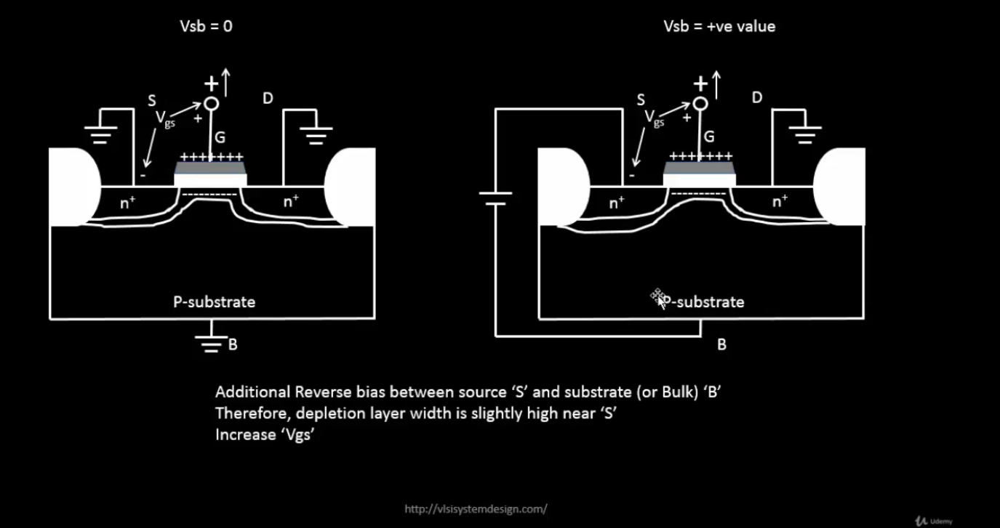

# ⚡ Task 1 – MOSFET Behavior: The Current-Voltage Chronicles

Where electrons meet electric fields and magic happens (well, physics actually)

## 🎯 Mission: Decode the MOSFET
The Challenge: Watch a tiny transistor transform from an insulator to a conductor and capture its entire personality in a graph.

### What We're Hunting For:

- 📈 How drain current (Id) responds to drain voltage (Vds)
- 🎚️ The magical moment when increasing voltage stops increasing current (saturation!)
- 🔬 The difference between "gentle slope" (linear) and "flat plateau" (saturation) regions

### 🎭 Why This Matters
MOSFETs are the building blocks of every digital chip. Understanding their Id-Vds curves is like learning the alphabet before writing novels—you can't design CMOS circuits without knowing how individual transistors behave!

---

## 🛠️ Setting Up Your Lab

### 🎬 Getting Started with SkyWater 130nm
First, grab the tools of the trade:

```bash
git clone https://github.com/kunalg123/sky130CircuitDesignWorkshop.git
cd sky130CircuitDesignWorkshop
```

### 📦 What's in the Toolbox?

| File | Purpose | Think of it as... |
|:-----|:--------|:------------------:|
| `sky130_fd_pr__nfet_01v8__tt.pm3.spice` | NMOS device model | The "DNA" of your transistor |
| `sky130.lib.pm3.spice` | Process library | The "physics textbook" for Sky130 |

---

## 🔌 Circuit Architecture

**Our Test Subject**: A humble NMOS transistor in its natural habitat

```
         Vds (variable)
            │
            ▼
        [Drain]
            │
    Vgs ──>[Gate]
            │
        [Source]
            │
           GND
```

<div align="center">


*The transistor under investigation—simple, elegant, powerful*

</div>

**Biasing Strategy:**

- 🔵 Drain → Connected to variable voltage (we'll sweep this!)
- 🟢 Gate → Fixed at Vgs (controls the "volume knob")
- ⚫ Source & Body → Grounded (our reference point)

---

## 🧬 The Physics Behind the Curtain

### 📚 MOSFET Operation: A Tale of Two Regions

| Region | When Does It Happen? | What's Going On? | The Math |
|:-------|:--------------------:|:----------------:|:--------:|
| 🌊 Linear (Ohmic) | Vgs > Vt<br>Vds ≪ (Vgs − Vt) | Channel is open and flowing — Acts like a voltage-controlled resistor | `Id = μn·Cox·(W/L)·[(Vgs−Vt)·Vds − Vds²/2]` |
| 🏔️ Saturation | Vds ≥ (Vgs − Vt) | Channel pinches off near drain — Current plateaus — More voltage, same current | `Id = ½·μn·Cox·(W/L)·(Vgs−Vt)²·(1+λVds)` |

---

### 🎢 The Journey of an Electron

```
Low Vds:                  High Vds:
  Gate                      Gate
   ↓                         ↓
S [===channel===] D      S [===▼ pinch] D
  ↑                         ↑
Linear flow               Saturated flow
```

### 🌀 The Body Effect Phenomenon

Ever notice how threshold voltage isn't always constant? Meet the body effect:

<div align="center">



</div>

When source voltage rises relative to body, the threshold voltage increases:

```
Vt = Vt0 + γ(√(2ΦF + VSB) − √(2ΦF))
```

Translation: Changing the body-source voltage is like adjusting the "difficulty level" for turning on the transistor!

---

## 🧪 The Experiment

### 📜 SPICE Incantation
* NMOS Id-Vds Characteristics
* Device: W=5µm, L=2µm

```
.lib "sky130_fd_pr/models/sky130.lib.spice" tt

* Our transistor (the star of the show!)
XM1 vdd n1 0 0 sky130_fd_pr__nfet_01v8 w=5 l=2

* Power supply
Vdd vdd 0 1.8

* Gate voltage
Vin in 0 1.8

* Sweep Vds from 0→1.8V, Vgs in steps of 0.2V
.dc Vdd 0 1.8 0.1 Vin 0 1.8 0.2

.end
```

### 🚀 Launch Sequence

```bash
ngspice day1_nfet_idvds_L2_W5.spice
```

Inside ngspice:

```
plot -vdd#branch
```

(The minus sign converts voltage source current to drain current—ngspice quirk!)

---

## 📊 Results: The Moment of Truth

### NMOS Characteristics

Id vs Vds for various Vgs values—the MOSFET's signature

### 🔍 Decoding the Curves

What You're Seeing:

```
High Vgs (1.5V) ─────────────────▄▄▄▄▄▄▄▄▄  ← Saturation plateau
                                ▄▄
Medium Vgs (0.9V) ─────────▄▄▄▄▄             ← Steeper = more current
                          ▄▄
Low Vgs (0.6V) ──────▄▄▄▄▄                   ← Barely conducting
                   ▄▄
                  │
                  └──── Linear region (slope ≈ 1/Ron)
```

### 💡 Key Observations

| Observation | What It Means | Design Implication |
|:-----------:|:-------------:|:------------------:|
| 📈 Steep initial slope | Low on-resistance in linear region | Good for switches and pass transistors |
| 🏔️ Flat saturation region | Current-source behavior | Ideal for amplifiers and current mirrors |
| 🎚️ Higher Vgs → Higher Id | More gate voltage = stronger channel | Faster switching, higher drive strength |
| 🔀 Curves don't overlap | Each Vgs creates unique operating point | Transistor acts as voltage-controlled current source |

### 📈 Performance Metrics

Summary Table: The Numbers Speak

| Vgs (V) | Transition Point Vds ≈ (Vgs − Vt) | Max Id (µA) | Operating Zone | Power @ 1.8V |
|:-------:|:---------------------------------:|:-----------:|:--------------:|:-----------:|
| 0.6 | ~0.3 V | 8 | 🟡 Weak inversion | ~14 µW |
| 0.9 | ~0.6 V | 24 | 🟢 Moderate | ~43 µW |
| 1.2 | ~0.9 V | 42 | 🟢 Strong | ~76 µW |
| 1.5 | ~1.2 V | 58 | 🔵 Maximum drive | ~104 µW |

### 🎯 Design Sweet Spots

- Digital Logic: Operate at Vgs = VDD for maximum drive (fastest switching)
- Analog Circuits: Operate in saturation for constant-current behavior
- Low Power: Use minimum Vgs that meets timing requirements

---

## 🧭 The Bigger Picture

### 🔗 How This Connects to Real Chips

This simple Id-Vds curve is the foundation for:

```
MOSFET Curves
     ↓
Drive Strength Calculation
     ↓
Gate Delay Models (τ = C·V/I)
     ↓
Timing Analysis (Setup/Hold)
     ↓
Chip Operating Frequency!
```

**Real-World Impact:**

- 💨 Speed: Higher Id → faster charging of load capacitance → higher MHz
- ⚡ Power: More current = more dynamic power (P = C·V²·f)
- 🎯 Reliability: Saturation region prevents current runaway

---

## 🎓 Key Takeaways

"Every digital gate is just MOSFETs playing tug-of-war with electrons"

### The Three Commandments of MOSFET Behavior

1. 🌊 Linear Region is Your Friend

- Low Rds(on) means efficient switches
- Critical for pass gates and transmission gates

2. 🏔️ Saturation is Where the Magic Happens

- Constant current = predictable behavior
- Foundation of amplifiers and logic gates

3. 🎚️ Vgs is the Control Knob

- More gate voltage = more current
- But also more power consumption!

---

## 🎯 Task 2 — Threshold Voltage & Velocity Saturation: The Speed Demons

When transistors get too fast for their own good (and why that's both awesome and problematic)

### 🎯 Mission: Extracting the Secret Threshold

The Quest: Find the magical voltage where the transistor "wakes up" and starts conducting. Plus, discover what happens when electrons hit their speed limit!

### 🔬 What We're After

- 🎚️ Threshold Voltage (Vt): The "ignition voltage" for the MOSFET
- ⚡ Velocity Saturation: When electrons can't go any faster (even if you want them to!)
- 🔗 CMOS Connection: How these effects shape inverter behavior

### 📐 Device Under Test (DUT) Specs

| Parameter | Value | Why It Matters |
|:---------:|:-----:|:---------------:|
| Width (W) | 1.8 µm | Determines max current capacity |
| Length (L) | 1.2 µm | Controls speed vs. current trade-off |
| Aspect Ratio (W/L) | 1.5 | The "strength" multiplier |

Design Note: W/L = 1.5 is modest—real designs might use 2× to 10× ratios for higher drive strength!

### 🗺️ Operation Regions: A Traveler's Guide

The Classic View (Long Channel Devices)

```
    Id
     │
     │        ┌────────────────  Saturation
     │       ╱                   (Id ≈ constant)
     │      ╱
     │     ╱  Linear
     │    ╱   (Id ∝ Vds)
     │   ╱
     │  ╱
     └─────────────────────────> Vds
       Vgs-Vt
```

| Region | Condition | Analogy |
|:------:|:---------:|:-------:|
| Linear | Vds < (Vgs − Vt) | Water flowing through an open pipe |
| Saturation | Vds ≥ (Vgs − Vt) | Water flow limited by pipe diameter (pinch-off) |

---

### ⚡ Enter Velocity Saturation: The Plot Twist!

#### 🏃 When Electrons Hit Their Speed Limit

In short-channel devices (L < 250 nm), electrons reach a maximum velocity (~10⁷ cm/s) and current becomes linear with (Vgs − Vt) instead of quadratic.

|  | Long Channel (L > 1 µm) | Short Channel (L < 250 nm) |
|:--:|:-----------------------:|:-------------------------:|
| Operating Modes | Cutoff, Linear, Saturation | Cutoff, Linear, Velocity Saturation, Saturation |
| Current Dependence | Id ∝ (Vgs − Vt)² | Id ∝ (Vgs − Vt) |
| Max Current | ~410 µA | ~210 µA |
| Switching Speed | Moderate | ⚡ Faster! |

### 🧮 The Velocity Saturation Equation

```
Id = W · Cox · vsat · (Vgs − Vt)
```

---

## 🧪 Laboratory Experiments

### 🔬 Experiment 1: Id vs Vds (The Classic Sweep)

Goal: See the full picture of MOSFET behavior

**Launch**

```
ngspice day2_nfet_idvds_L015_W039.spice
```

### 🔬 Experiment 2: Id vs Vgs (The Threshold Hunt)

Goal: Extract Vt and see the turn-on behavior

**Launch**

```
ngspice day2_nfet_idvgs_L015_W039.spice
```

---

## 🎯 Threshold Voltage Extraction: The Detective Work

### 🔍 Method: Square Root Extrapolation

The Technique:

1. Plot √Id vs Vgs (instead of Id vs Vgs)
2. Find the linear region in strong inversion
3. Extrapolate back to x-axis
4. X-intercept = Vt

---

## 🎛️ The CMOS Inverter Connection
