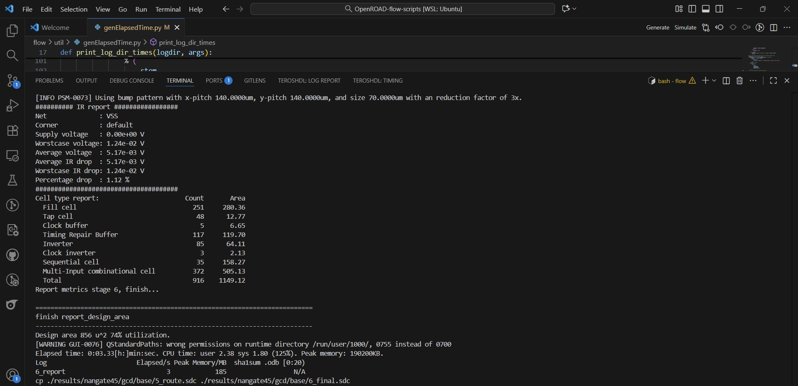
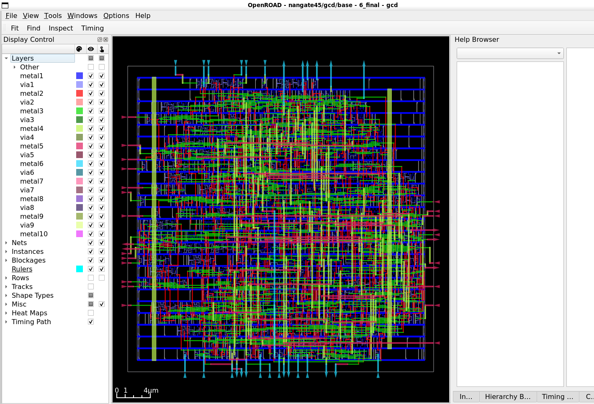
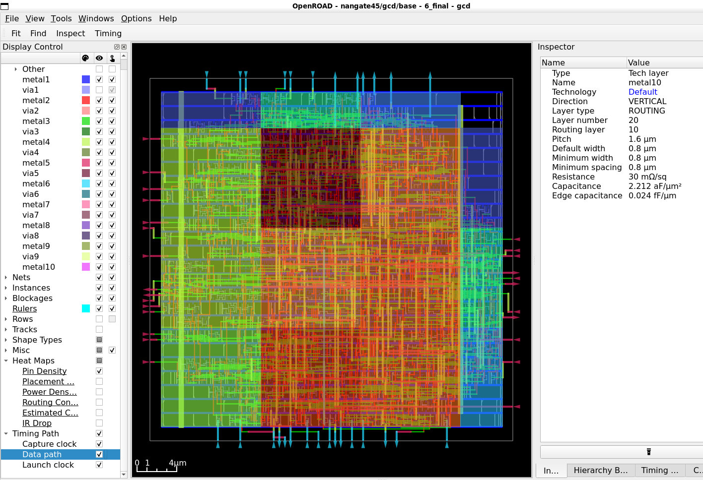
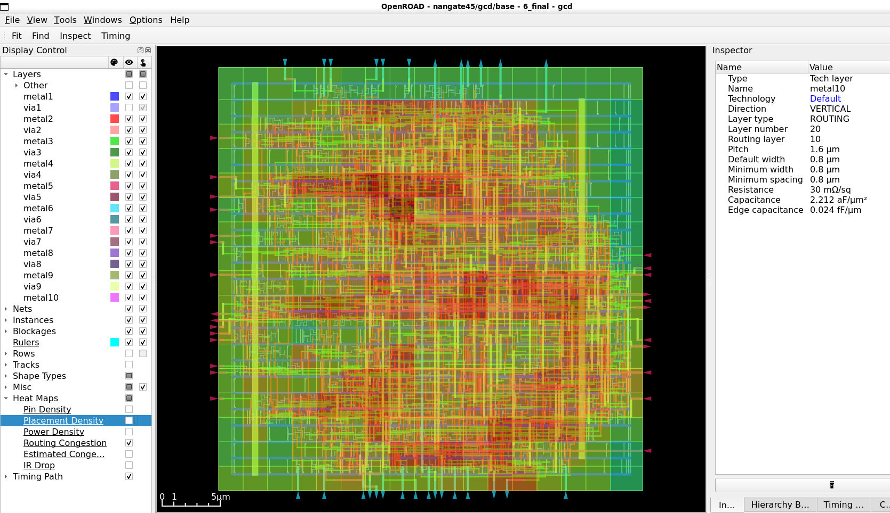

# 📋 Week 5: OpenROAD Flow Setup - Floorplan & Placement

This document reproduces the Week 5 assignment for the OpenROAD flow setup and
execution of the Floorplan and Placement stages. Follow the steps below and
collect the requested artifacts (screenshots, logs, images) for submission.

---

## 🔄 The Physical Design Journey

```
📝 RTL Code → 🔨 Synthesis → 📐
Floorplan → 📍 Placement → 🛣️ Routing → 💾 GDSII
                              [WE ARE
HERE ✋]        [STOP HERE!]
```

---

## 🌟 What is OpenROAD?

**OpenROAD** is an open-source, fully automated **RTL-to-GDSII flow** for digital
IC design. It transforms your hardware description into actual silicon layout
through synthesis, floorplanning, placement, clock tree synthesis, routing, and
final layout generation.

✨ Why OpenROAD?
- Rapid design iterations
- Great for academic research
- Industry-relevant prototyping
- Completely open-source

---

## 📂 Task Reference

Use this repository as a reference for installation and running the required
flow steps:

OpenROAD Reference – https://github.com/spatha0011/spatha_vsdhdp/blob/main/Day14/README.md

---

## 🎯 Objective

Set up the OpenROAD Flow Scripts environment and execute the Floorplan and
Placement stages only. Verify the floorplan and placement outputs and collect
evidence (logs, screenshots, images) as deliverables.

---

## 🔧 Task Components

1) Install OpenROAD Flow Scripts
- Clone and install OpenROAD Flow Scripts on a Linux system.
- Follow prerequisite installations listed in the reference repo.
- Verify setup by launching the OpenROAD environment (flow.tcl or equivalent).

2) Execute Floorplan and Placement (Only These Two Stages)
- Run the OpenROAD flow up to Floorplan and Placement. Stop before routing.
- Confirm core area and die dimensions are generated.
- Confirm standard cells are placed successfully.
- Review logs and intermediate files produced during these stages.

---

## 🚀 Installation & Execution Flow (example)

> The exact commands depend on your environment. The steps below are an
> example using the OpenROAD-flow-scripts repository.

1️⃣ Clone the repository

```bash
git clone --recursive https://github.com/The-OpenROAD-Project/OpenROAD-flow-scripts
cd OpenROAD-flow-scripts
```

2️⃣ Run setup script

```bash
sudo ./setup.sh
```

3️⃣ Build OpenROAD tools (example)

```bash
./build_openroad.sh --local
```

4️⃣ Verify installation

```bash
source ./env.sh
yosys -h
openroad -h
```

5️⃣ Execute Floorplan + Placement

```bash
cd flow
make
```

What this runs:
- Floorplan stage: defines core area, die dimensions, I/O placement
- Placement stage: arranges standard cells to minimize delay & congestion
- STOP before routing (as required)


*Floorplan stage completion*
*Placement stage completion logs*

6️⃣ Visualize results

```bash
make gui_final
```


*Main layout view showing placed standard cells*


*Visual representation of pin distribution*


*Congestion analysis (for future routing stages)*

---

## 📊 What We Accomplished

| Stage | Status | Output |
|-------|--------|--------|
| Installation | ✅ Complete | Tools verified & operational |
| Floorplan | ✅ Complete | Core area & die dimensions defined |
| Placement | ✅ Complete | Standard cells optimally placed |
| Routing | ⏸️ Not Done | Stopped as per requirements |

---

## 🎓 Key Learnings

### 🔍 What is Floorplanning?
- Defines chip boundaries and core area
- Places I/O pads and power rails
- Establishes placement blockages
- Impact: Determines overall design feasibility

### 🔍 What is Placement?
- Arranges standard cells within core area
- Optimizes for timing, area, and power
- Considers routing congestion
- Impact: Directly affects design performance

---

## 🎉 Conclusion

Successfully installed **OpenROAD Flow Scripts** and completed **Floorplan +
Placement** stages. The design is now ready for Clock Tree Synthesis and
Routing in future weeks.


---


