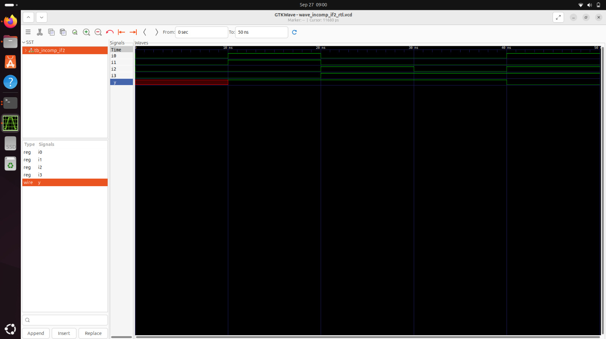
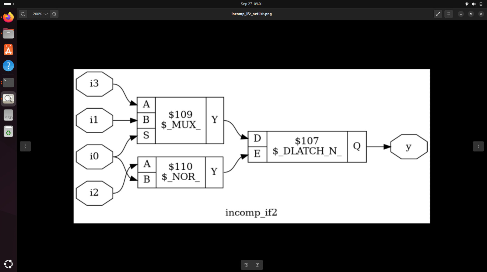
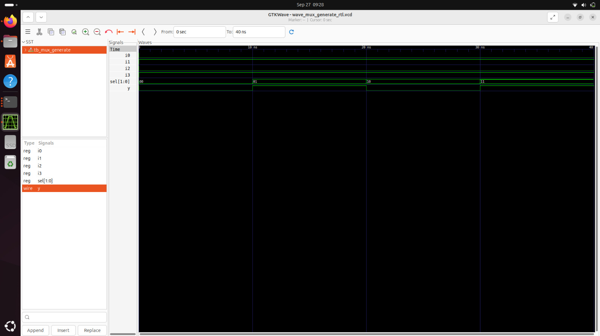
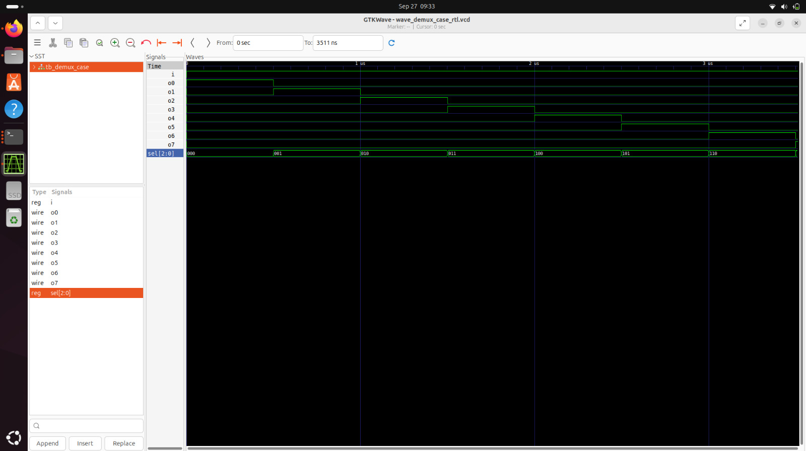
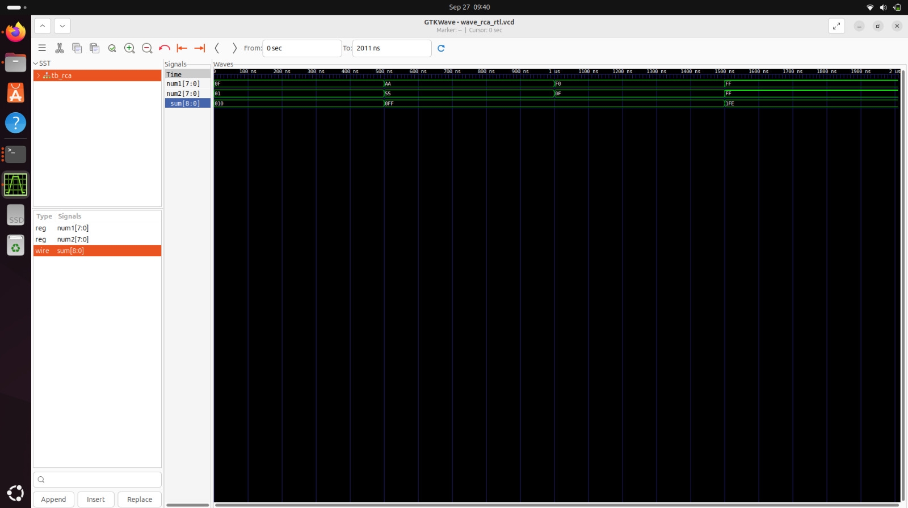

# Day 5: Advanced Synthesis Optimization Techniques

Welcome to **Day 5** - the final day of our RTL Workshop! Today we explore advanced synthesis optimization techniques, focusing on if-else statements, case constructs, for loops, and generate blocks. You'll learn how different coding styles impact synthesis results and master techniques for creating scalable, efficient hardware designs.

---

## 🎯 Learning Objectives

By the end of Day 5, you will:
- Master optimization techniques for if-else and case statements
- Understand when and how synthesis tools infer latches
- Implement synthesizable for loops and generate blocks effectively
- Create scalable hardware designs using parameterized constructs
- Analyze the impact of coding choices on synthesis results
- Apply advanced Verilog constructs for complex digital systems

---

## Table of Contents

1. [If-Else Statements and Synthesis](#1-if-else-statements-and-synthesis)
2. [Latch Inference and Prevention](#2-latch-inference-and-prevention)
3. [Case Statement Optimization](#3-case-statement-optimization)
4. [For Loops in Hardware Design](#4-for-loops-in-hardware-design)
5. [Generate Blocks for Scalable Design](#5-generate-blocks-for-scalable-design)
6. [Advanced Laboratory Exercises](#6-advanced-laboratory-exercises)
7. [Design Patterns and Best Practices](#7-design-patterns-and-best-practices)
8. [Summary](#8-summary)

---

## 1. If-Else Statements and Synthesis

### 🔍 If-Else Statement Structure

**If-else statements** are fundamental constructs in Verilog for modeling conditional behavior. Their synthesis depends heavily on completeness and structure:

```verilog
if (condition1) begin
    // Action for condition1 true
end else if (condition2) begin
    // Action for condition2 true
end else begin
    // Default action (prevents latch inference)
end
```

### ⚡ Synthesis Implications

**Complete If-Else (Combinational Logic):**
```verilog
always @(*) begin
    if (sel == 2'b00)
        y = a;
    else if (sel == 2'b01)
        y = b;
    else if (sel == 2'b10)
        y = c;
    else
        y = d;  // Complete - no latch inference
end
```

**Incomplete If-Else (Latch Inference):**
```verilog
always @(*) begin
    if (enable)
        y = data;
    // Missing else - y retains previous value
    // Results in latch inference
end
```

### 🎯 Priority vs. Parallel Logic

**If-Else Priority Structure:**
- Creates priority-encoded logic
- First condition has highest priority
- Later conditions checked only if earlier ones are false
- Can create longer critical paths

**Synthesis Result:** Priority encoder with cascaded multiplexers

---

## 2. Latch Inference and Prevention

### 🚨 Understanding Latch Inference

**Latches are inferred when:**
- Variables are not assigned in all possible execution paths
- Incomplete if-else statements in combinational always blocks
- Incomplete case statements without default

### 🔍 Latch Inference Example

**Problematic Code:**
```verilog
module latch_example (
    input wire enable, data,
    output reg q
);
    always @(*) begin
        if (enable)
            q = data;
        // No else clause - q retains value when enable=0
        // Synthesis tool infers a latch
    end
endmodule
```

**Synthesis Inference:**
```
When enable=1: q follows data (transparent mode)
When enable=0: q holds previous value (latch mode)
```

### ✅ Preventing Unwanted Latch Inference

**Method 1: Complete If-Else**
```verilog
always @(*) begin
    if (enable)
        q = data;
    else
        q = 1'b0;  // Explicit assignment prevents latch
end
```

**Method 2: Default Assignment**
```verilog
always @(*) begin
    q = 1'b0;      // Default value
    if (enable)
        q = data;   // Conditional override
end
```

**Method 3: Ternary Operator**
```verilog
assign q = enable ? data : 1'b0;  // Always drives output
```

### 🎯 When Latches are Desired

**Intentional Latch Design:**
```verilog
module intended_latch (
    input wire enable, data,
    output reg q
);
    always @(*) begin
        if (enable)
            q = data;
        // Intentionally no else - creates desired latch behavior
    end
    // Synthesis directive to confirm intentional latch
    // synthesis syn_preserve
endmodule
```

---

## 3. Case Statement Optimization

### 📋 Case Statement Structure

**Case statements** provide an efficient way to model multi-way branching logic:

```verilog
case (select_signal)
    value1: begin
        // Action for value1
    end
    value2: begin
        // Action for value2
    end
    default: begin
        // Default action (recommended)
    end
endcase
```

### 🔄 Complete vs. Incomplete Case Statements

**Complete Case Statement:**
```verilog
always @(*) begin
    case (sel)
        2'b00: y = a;
        2'b01: y = b;
        2'b10: y = c;
        2'b11: y = d;
        // All possible values covered
    endcase
end
```

**Incomplete Case with Default:**
```verilog
always @(*) begin
    case (sel)
        2'b00: y = a;
        2'b01: y = b;
        default: y = c;  // Covers remaining cases
    endcase
end
```

### ⚠️ Synthesis Warnings and Solutions

**Full Case vs. Parallel Case:**
- **Full Case**: All possible input combinations specified
- **Parallel Case**: No overlapping case items
- **Priority Case**: Overlapping items resolved by order

**Synthesis Directives:**
```verilog
case (sel) // synthesis full_case parallel_case
    2'b00: y = a;
    2'b01: y = b;
    // Tells synthesis tool all cases covered and non-overlapping
endcase
```

---

## 4. For Loops in Hardware Design

### 🔄 For Loop Fundamentals

**For loops** in hardware description create **unrolled logic** during synthesis:

```verilog
for (initialization; condition; increment) begin
    // Statements executed for each iteration
    // Creates parallel hardware for each iteration
end
```

### ⚡ Synthesizable For Loop Requirements

**Requirements for Synthesis:**
1. **Compile-time bounds**: Loop limits must be constants
2. **Finite iterations**: Must have deterministic termination
3. **No dynamic termination**: Conditions must be evaluable at synthesis

### 🎯 For Loop Applications

**Example 1: Parallel Logic Generation**
```verilog
module parallel_and (
    input [7:0] data_in,
    output reg result
);
    integer i;
    always @(*) begin
        result = 1'b1;
        for (i = 0; i < 8; i = i + 1) begin
            result = result & data_in[i];
        end
    end
endmodule
```

**Synthesis Result:** 8-input AND gate

**Example 2: Multiplexer Implementation**
```verilog
module mux_4to1_loop (
    input [3:0] data,
    input [1:0] sel,
    output reg y
);
    integer i;
    always @(*) begin
        y = 1'b0;  // Default value
        for (i = 0; i < 4; i = i + 1) begin
            if (i == sel)
                y = data[i];
        end
    end
endmodule
```

### 🔧 For Loop Best Practices

1. **Use integer variables** for loop counters
2. **Keep loop bounds small** to avoid excessive logic
3. **Consider area vs. speed trade-offs**
4. **Verify synthesis results** to ensure expected behavior

---

## 5. Generate Blocks for Scalable Design

### 🏗️ Generate Block Fundamentals

**Generate blocks** create multiple instances of hardware structures at **compile time**:

```verilog
genvar i;
generate
    for (i = 0; i < N; i = i + 1) begin : gen_loop
        // Hardware instantiated N times
    end
endgenerate
```

### 🎯 Generate Block Applications

**1. Array of Modules:**
```verilog
module register_file #(parameter WIDTH = 8, DEPTH = 16) (
    input clk, reset,
    input [WIDTH-1:0] data_in,
    input [$clog2(DEPTH)-1:0] addr,
    input write_en,
    output [WIDTH-1:0] data_out
);
    genvar i;
    wire [WIDTH-1:0] reg_data [DEPTH-1:0];
    
    generate
        for (i = 0; i < DEPTH; i = i + 1) begin : gen_registers
            register_module #(.WIDTH(WIDTH)) reg_inst (
                .clk(clk),
                .reset(reset),
                .data_in(data_in),
                .write_en(write_en & (addr == i)),
                .data_out(reg_data[i])
            );
        end
    endgenerate
    
    assign data_out = reg_data[addr];
endmodule
```

**2. Ripple Carry Adder Implementation:**
```verilog
module ripple_carry_adder #(parameter WIDTH = 8) (
    input [WIDTH-1:0] a, b,
    input cin,
    output [WIDTH-1:0] sum,
    output cout
);
    wire [WIDTH:0] carry;
    assign carry[0] = cin;
    assign cout = carry[WIDTH];
    
    genvar i;
    generate
        for (i = 0; i < WIDTH; i = i + 1) begin : gen_fa
            full_adder fa_inst (
                .a(a[i]),
                .b(b[i]),
                .cin(carry[i]),
                .sum(sum[i]),
                .cout(carry[i+1])
            );
        end
    endgenerate
endmodule
```

### 🔄 Generate vs. For Loop Comparison

| Feature | Generate Block | For Loop |
|---------|---------------|----------|
| **Execution Time** | Compile time | Simulation/synthesis time |
| **Hardware Created** | Multiple instances | Unrolled combinational logic |
| **Use Case** | Module instantiation | Logic operations |
| **Parameterization** | Excellent | Limited |
| **Area Impact** | Controlled by parameters | Fixed by loop bounds |

---

## 6. Advanced Laboratory Exercises

### 🔬 Lab 1: Incomplete If Statement Analysis

**Design Under Test:**
```verilog
module incomp_if (
    input i0, i1, i2,
    output reg y
);
    always @(*) begin
        if (i0)
            y <= i1;
        // Missing else clause - latch inference expected
    end
endmodule
```


**Analysis:**
- Latch inferred when `i0 = 0`
- Output `y` holds previous value
- Synthesis warning about inferred latch

**Synthesis Result:**


**Key Observations:**
- Tool creates latch structure to hold state
- Additional control logic for enable signal
- Area and timing implications

### 🔬 Lab 2: Nested If-Else Structure

**Design Under Test:**
```verilog
module incomp_if2 (
    input i0, i1, i2, i3,
    output reg y
);
    always @(*) begin
        if (i0)
            y <= i1;
        else if (i2)
            y <= i3;
        // Missing final else - partial latch inference
    end
endmodule
```



**Complex Latch Inference:**
- Latch inferred when `i0 = 0` AND `i2 = 0`
- Priority structure creates cascaded logic
- More complex control logic required



### 🔬 Lab 3: Complete Case Statement

**Design Under Test:**
```verilog
module comp_case (
    input i0, i1, i2,
    input [1:0] sel,
    output reg y
);
    always @(*) begin
        case(sel)
            2'b00: y = i0;
            2'b01: y = i1;
            default: y = i2;  // Complete case
        endcase
    end
endmodule
```


**Clean Multiplexer Synthesis:**
- No latch inference due to complete case coverage
- Efficient multiplexer implementation
- Clean timing characteristics


### 🔬 Lab 4: Partial Case Assignment

**Design Under Test:**
```verilog
module partial_case (
    input a, b,
    input [1:0] sel,
    output reg x, y
);
    always @(*) begin
        case(sel)
            2'b00: begin
                x = a;
                // y not assigned - latch inference for y only
            end
            2'b01: y = b;
            // No assignment to x - latch inference for x
        endcase
    end
endmodule
```


**Selective Latch Inference:**
- Latches inferred only for signals not assigned in all paths
- Mixed combinational and sequential behavior
- Complex synthesis optimization required


### 🔬 Lab 5: Bad Case Example

**Design Under Test:**
```verilog
module bad_case (
    input a, b, c,
    input [1:0] sel,
    output reg y
);
    always @(*) begin
        case(sel)
            2'b00: y = a;
            2'b01: y = b;
            // Missing cases for 2'b10 and 2'b11
        endcase
    end
endmodule
```


**Multiple Issue Example:**
- Incomplete case coverage
- Latch inference for unspecified cases
- Synthesis warnings and suboptimal implementation

### 🔬 Lab 6: For Loop Multiplexer

**Design Under Test:**
```verilog
module mux_generate (
    input i0, i1, i2, i3,
    input [1:0] sel,
    output reg y
);
    wire [3:0] i_int;
    assign i_int = {i3, i2, i1, i0};
    
    integer k;
    always @(*) begin
        for (k = 0; k < 4; k = k + 1) begin
            if (k == sel)
                y = i_int[k];
        end
    end
endmodule
```



**For Loop Synthesis:**
- Unrolled into parallel comparison logic
- Each iteration creates conditional assignment
- Synthesis optimizes to efficient multiplexer

### 🔬 Lab 7: Demux with Case Statement

**Design Under Test:**
```verilog
module demux_case (
    input i,
    input [1:0] sel,
    output reg y00, y01, y10, y11
);
    always @(*) begin
        y00 = 1'b0; y01 = 1'b0; y10 = 1'b0; y11 = 1'b0;
        case(sel)
            2'b00: y00 = i;
            2'b01: y01 = i;
            2'b10: y10 = i;
            2'b11: y11 = i;
        endcase
    end
endmodule
```



**Demultiplexer Implementation:**
- Default assignments prevent latch inference
- Case statement creates efficient decoder
- One-hot output selection based on select lines

### 🔬 Lab 8: Demux with Generate Block

**Design Under Test:**
```verilog
module demux_generate (
    input i,
    input [1:0] sel,
    output [3:0] y
);
    genvar k;
    generate
        for (k = 0; k < 4; k = k + 1) begin : gen_demux
            assign y[k] = (sel == k) ? i : 1'b0;
        end
    endgenerate
endmodule
```


**Generate Block Advantages:**
- Parameterizable design
- Clean, scalable code structure
- Efficient synthesis results

### 🔬 Lab 9: Ripple Carry Adder

**Design Under Test:**
```verilog
module rca (
    input [7:0] num1, num2,
    output [8:0] sum
);
    wire [7:0] int_sum;
    wire [7:0] int_co;
    
    genvar i;
    generate
        for (i = 1; i < 8; i = i + 1) begin : gen_fa
            fa u_fa_1 (
                .a(num1[i]),
                .b(num2[i]),
                .c(int_co[i-1]),
                .co(int_co[i]),
                .sum(int_sum[i])
            );
        end
    endgenerate
    
    fa u_fa_0 (
        .a(num1[0]),
        .b(num2[0]),
        .c(1'b0),
        .co(int_co[0]),
        .sum(int_sum[0])
    );
    
    assign sum[7:0] = int_sum;
    assign sum[8] = int_co[7];
endmodule
```



**Generate Block for Adder Chain:**
- Scalable adder implementation
- Clear carry chain structure
- Parameterizable width capability

---

## 7. Design Patterns and Best Practices

### 🎯 Coding Guidelines for Synthesis

**1. Complete Assignments:**
```verilog
// Always provide complete case coverage
always @(*) begin
    case (sel)
        // ... all cases
        default: out = 1'b0;  // Explicit default
    endcase
end
```

**2. Avoid Unintended Latches:**
```verilog
// Use default assignments
always @(*) begin
    y = 1'b0;        // Default value
    if (condition)
        y = data;     // Conditional assignment
end
```

**3. Parameterizable Designs:**
```verilog
module scalable_design #(
    parameter WIDTH = 8,
    parameter DEPTH = 16
) (
    // Port declarations using parameters
    input [WIDTH-1:0] data_in,
    input [$clog2(DEPTH)-1:0] addr
    // ...
);
```

### 🔄 Synthesis Optimization Techniques

**1. Resource Sharing:**
```verilog
// Share arithmetic resources across different operations
always @(*) begin
    case (operation)
        ADD: result = a + b;
        SUB: result = a - b;
        // Same ALU shared for different operations
    endcase
end
```

**2. Pipeline Balancing:**
```verilog
// Use generate blocks for balanced pipeline stages
genvar stage;
generate
    for (stage = 0; stage < PIPELINE_DEPTH; stage = stage + 1) begin
        pipeline_stage #(.STAGE(stage)) stage_inst (
            // Balanced processing in each stage
        );
    end
endgenerate
```

### ⚡ Performance Optimization

**1. Critical Path Analysis:**
- Identify longest combinational paths
- Use pipelining for high-frequency designs
- Balance logic depth across stages

**2. Area-Speed Trade-offs:**
- Use for loops for area-optimized implementations
- Use generate blocks for speed-optimized parallel structures
- Consider resource sharing vs. dedicated resources

---

## 8. Summary

### 🎯 Comprehensive Achievement Summary

Congratulations! You have successfully completed all five days of the RTL Workshop and mastered:

- ✅ **Advanced Synthesis Optimization**: Mastered if-else and case statement optimization techniques
- ✅ **Latch Analysis and Prevention**: Understood latch inference mechanisms and prevention strategies  
- ✅ **Scalable Design Techniques**: Implemented for loops and generate blocks for parameterizable hardware
- ✅ **Synthesis-Aware Coding**: Applied best practices for efficient and predictable synthesis results
- ✅ **Complex Design Patterns**: Created sophisticated digital systems using advanced Verilog constructs
- ✅ **Performance Analysis**: Evaluated trade-offs between area, speed, and power in synthesized designs

### 🏆 Workshop Completion Milestones

**Day 1 Foundation:** ✅ Simulation, basic synthesis, and tool familiarization  
**Day 2 Advancement:** ✅ Timing libraries, synthesis approaches, and flip-flop coding  
**Day 3 Optimization:** ✅ Combinational and sequential logic optimization techniques  
**Day 4 Verification:** ✅ Gate-level simulation and synthesis-simulation mismatch resolution  
**Day 5 Mastery:** ✅ Advanced optimization and scalable design implementation  

### 🔑 Professional Skills Developed

**Technical Expertise:**
- Complete RTL design methodology proficiency
- Advanced Verilog coding techniques
- Synthesis optimization and analysis skills
- Comprehensive verification methodologies

**Industry-Ready Capabilities:**
- Debug complex synthesis and timing issues
- Create scalable, parameterizable IP blocks
- Apply systematic design optimization approaches
- Follow industry-standard coding practices

### 🚀 Career Impact

The comprehensive skills learned in this workshop prepare you for:
- **ASIC Design Engineer**: Full RTL-to-GDS design flow
- **FPGA Design Engineer**: High-performance FPGA implementations
- **Verification Engineer**: Advanced testbench development and debug
- **IP Developer**: Creating reusable, optimized hardware blocks
- **Research & Development**: Cutting-edge digital design projects

---

### 💡 Continued Learning Recommendations

**Next Steps for Advanced Mastery:**
1. **SystemVerilog**: Advanced verification and design capabilities
2. **UVM (Universal Verification Methodology)**: Industry-standard verification framework
3. **Physical Design**: Place and route, timing closure, power analysis
4. **Formal Verification**: Mathematical proof of design correctness
5. **High-Level Synthesis**: C/C++ to RTL conversion techniques

**Professional Development:**
- Join IEEE and local VLSI communities
- Contribute to open-source EDA projects
- Attend conferences (DAC, ICCAD, DATE)
- Pursue advanced certifications in EDA tools
- Build a portfolio of complex design projects

---

<div align="center">

**🎉🎊 CONGRATULATIONS! 🎊🎉**

**You have successfully completed the comprehensive RTL Design and Synthesis Workshop!**

*You now possess industry-level skills in digital design, synthesis, and verification.*

**🌟 You are ready to excel in the digital design industry! 🌟**

### 🏆 Workshop Completion Certificate 🏆
*This README serves as documentation of your successful completion of all workshop objectives and practical implementations.*

</div>

---

## 📚 Comprehensive Resource Library

### **Fundamental References:**
- [Verilog HDL: A Guide to Digital Design and Synthesis](https://www.amazon.com/Verilog-HDL-Guide-Digital-Synthesis/dp/0130449113)
- [Digital Design and Computer Architecture](https://www.amazon.com/Digital-Design-Computer-Architecture-Harris/dp/0123944244)

### **Advanced Topics:**
- [SystemVerilog for Verification](https://www.amazon.com/SystemVerilog-Verification-Guide-Learning/dp/0387270140)
- [Static Timing Analysis for Nanometer Designs](https://www.amazon.com/Static-Timing-Analysis-Nanometer-Designs/dp/0387938192)

### **Open Source Tools:**
- [Yosys Documentation](http://www.clifford.at/yosys/documentation.html)
- [Sky130 PDK](https://skywater-pdk.readthedocs.io/)
- [OpenROAD Project](https://openroad.readthedocs.io/)

### **Professional Communities:**
- [IEEE SSCS](https://sscs.ieee.org/) - Solid-State Circuits Society
- [VLSI Research](https://www.vlsiresearch.com/) - Industry Analysis
- [EDA Consortium](https://www.edac.org/) - EDA Industry Organization

---

**🚀 Thank you for completing this journey with excellence and dedication! 🚀**

**Your commitment to learning and mastery will drive innovation in digital design!**